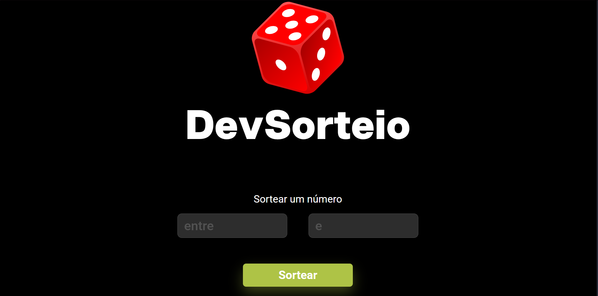

# 🎲 DevSorteio

Uma aplicação web simples e interativa para **sortear números aleatórios**, desenvolvida com **HTML**, **CSS** e **JavaScript**.  
Ideal para sorteios rápidos, dinâmicos e com uma interface intuitiva.

---

## 📸 Demonstração

### Página principal  

---

## 🚀 Funcionalidades

- 🔢 Sorteio de números entre dois valores definidos pelo usuário  
- 🖱️ Botão para iniciar o sorteio de forma rápida  
- 🌐 Interface amigável, responsiva e com visual moderno  
- 🔍 Validação básica de entrada para evitar erros

---

## 🛠️ Tecnologias utilizadas

- **HTML5** → estrutura da aplicação  
- **CSS3** → estilização visual e responsiva  
- **JavaScript** → lógica de sorteio e interatividade com o usuário

---

## 📂 Estrutura do projeto
┣ 📂 assets # Imagens e ícones 
┣ 📜 index.html # Página principal 
┣ 📜 style.css # Estilo da interface 
┣ 📜 script.js # Lógica de sorteio 
┗ 📜 README.md # Documentação do projeto 
